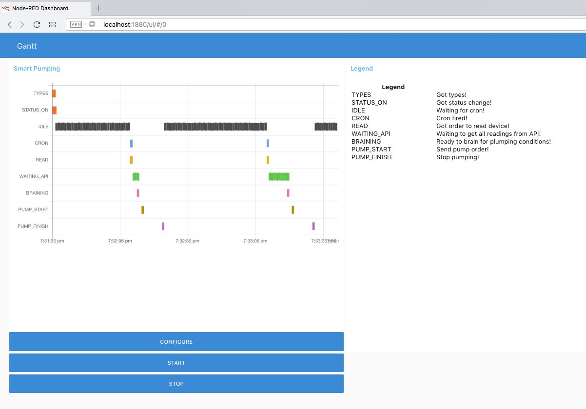

Smart Pumper
----------------------

Es un microservicio type-wired para Smart Gardener. *Microservicio* en el sentido de que Smart Pumper es un blob  que dadas unas condiciones de inicio performa una funcionalidad. *Type-wired* en el sentido de que existen unos 'tipos enlazados'. **Smart Gardener** es una formulación de Smart Citizen como CGV Wall Manager.

**Tipos**:
- Lista de dispositivos con sensores.
- Lista de bombas de riego.
- Fórmula de riego.
- Cron.

**Enlaces**:
- Sensores: lectura condiciones.
- Actuadores: escritura de acciones.

Por tanto, en el contexto del campo de verdad de Wall Manager, Smart Pumpler incluye la manipulación de sensores (humedad y temperatura) y actuadores (bomba de riego). Mientras que la funcionalidad del servicio se describe como: **riego inteligente (por umbrales) a partir de las condiciones de humedad y temperatura**.

En el siguiente gráfico se muestra el gantt de acciones del sistema.



Acciones:

- TYPES: El sistema recibe llamada POST con configuración.
- STATUS_ON: El sistema recibe orden de activar timer (cron).
- IDLE: El sistema espera a que llegue la hora de regar.
- CRON: Llegada la hora de regar, se computa que las condiciones sean adecuadas.
- READ: Petición de lectura de los sensores para determinar las condiciones (temperatura, humedad)
- WAITING_API: Espera a que todos los sensores reporten sus datos.
- BRAINING: Una vez recibidos los datos con las últimas mediciones (o histórico) se computa la fórmula.
- PUMP_START: Aprobada la fórmula, se manda la orden de riego a la bomba IoT.
- PUMP_ABORT: Las condiciones no requieren riego, se aborta el ciclo en espera de la próxima hora de riego.
- PUMP_FINISH: Pasado el tiempo de riego, se envía orden de detener la bomba IoT.
- STATUS_OFF: El sistema recibe orden de desactivar timer (cron).

Instalación
-----------------------
El *microservicio type-wired para Smart Gardener* llamado Smart Pumper corre sobre **Node-Red**. Ya que Node-Red se sirve desde un servidor NodeJs es agnóstico respecto de la plataforma y como cualquier servicio tcp/ip puede operar dentro de la red local o desde la nube (nota para el caso cloud: es necesaria pasarela Hub/Box para instalaciones Cloud: un Smart Pumper Hub en el Cloud conjugado con un Smart Pumper Box en la red local).

Smart Pumper se presenta en forma de **Flow/Subflows en archivo .JSON** (referir documentación oficial NodeRed para importar).

Configuración
-----------------------
Por definición de las soluciones tipo *type*, deben establecerse las condiciones de inicio en la formulación de tipos:

- Lista de dispositivos  
Los despositivos se inflan desde la api.smarticizen/devices, los sensores se inflan desde al api.smartciziten/devices/sensors.

- Lista de bombas de riego  
Los dispositivos KnX se inflan directamente en Smart Pumper (importando configuración ETS). Opcional, instalar nodos-openhab para otros protocolos.

- Fórmula de riego  
Discriminando día o noche, mediante umbrales, se aplica árbol de decisión sobre la temperatura y la humedad tanto en ambiente como en tierra.

- Cron  
Lanzador de validación: lista de horas en las que debe lanzarse el servicio. Opcional, instalar módulo openhab-rules/zoningbox-events para mayor sofisticación.

Premisa de las soluciones de tipo *type-wiring*, deben establecerse las condiciones de relación entre los tipos:

- Sensores SmartCitizen  
Enlace Smart Pumper con api Smart Citizen en modo lectura.
- Bomba de riego  
Enlace Smart Pumper con campo de verdad en modo escritura.

Uso
--------------------
Este apartado se ha dividido en tres secciones que corresponden a las fases del ciclo de uso de Smart Pumpler:

- Introducción tipos
- Activación relaciones
- Monitorización

## Introducción tipos

Para insertar en el sistema la definición de tipos hacer POST a **/types_manager** adjuntando el nodo de configuración. Ver detalles del nodo abajo:

```json
{
	truthField: ...,
	formula: ...,
	cron: ...
}
```

Campo de verdad.

```json
{
	truthField: {
		sensors: [
			{
				device_id: 9999,
				sensors:
					{
						tempGround: 9999,
						tempAmbient: 9999,
						humidity: 9999,
						moisture: 9999
					}
			},
			{}
		],
		actuators: [
			{
				knx_id: 9999,
				groupAddress: "99>99>99",
				features: [ 
					{
						featureStart: "ON"
					},
					{
						featureStop: "OFF"
					}
				]
			},
			{}
		]
	},
```

Fórmula de riego:

```json
{
	formula: {
		day: {

			temperatureMin: 99,
			temperatureMax: 99,
			humidityMin: 99,
			humidityMax: 99,
			moistureMin: 99,
			moistureMax: 99,
			pumpingSeconds: 99
		},
		night: {
			temperatureMin: 99,
			temperatureMax: 99,
			humidityMin: 99,
			humidityMax: 99,
			moistureMin: 99,
			moistureMax: 99,
			pumpingSeconds: 99
		}
	}
}
```

Lanzador del regador (horas):

```json
{
	cron: [0-23, 0-23,...]
}
```

## Activación relaciones

Una vez configurado el sistema, arrancarlo o pararlo enviando POST a **/engine_manager** con nodo de configuración:

```json
{
	"ACTION"
}
```

Acciones (ACTION) disponibles:

- ON
- OFF

## Monitorización

Accediendo a la interfaz gráfica (**/ui**) es posible visualizar el gantt de acciones del sistema.

# Ejemplo

Ejemplo CMat, se compone de: 2 Smart Citizen + 1 bomba KnX.

Fichero de inicialización de tipos:

```json
{
    "truthField": {
        "sensors": [
            {
                "device_id": 5616,
                "sensors": {
                    "tempGround": 56,
                    "tempAmbient": 45,
                    "humidity": 50,
                    "moisture": 51
                }
            },
            {
                "device_id": 5619,
                "sensors": {
                    "tempGround": 56,
                    "tempAmbient": 45,
                    "humidity": 50,
                    "moisture": 51
                }
            }
        ],
        "actuators": [
            {
                "knx_id": 23,
                "groupAddress": "01>01>02",
                "features": [
                    {
                        "featureStart": "ON"
                    },
                    {
                        "featureStop": "OFF"
                    }
                ]
            }
        ]
    },
    "formula": {
        "day": {
            "temperatureMin": 18,
            "temperatureMax": 26,
            "humidityMin": 40,
            "humidityMax": 75,
            "moistureMin": 40,
            "moistureMax": 75,
            "pumpingSeconds": 10
        },
        "night": {
            "temperatureMin": 15,
            "temperatureMax": 24,
            "humidityMin": 30,
            "humidityMax": 70,
            "moistureMin": 40,
            "moistureMax": 75,
            "pumpingSeconds": 5
        }
    },
    "cron": [10, 50]
}
```
