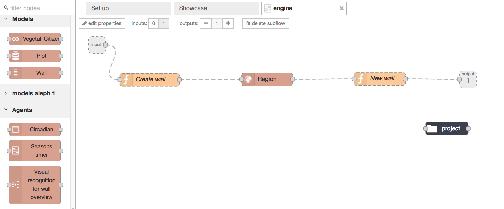
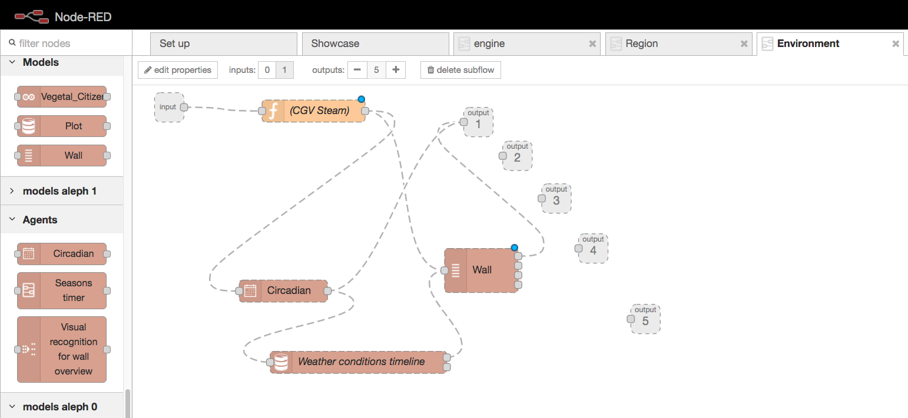

A wizard to...
===================
This showcase illustrates a wizard to setup CGV walls.

Components
=================
A set of categories and nodes to configure ad hoc walls.

General idea
================
A wizard to create a wall. Then, monitoring. Then, interaction.

Engine
============
The following order: 

'''
Create a wall, "5x5" sized, that will be located
at region: "Europe South" for "Basil".
'''
... goes into an "engine", and it does all the needed stuff to
create the wall.

Region
==============
Further discussing with the biologist points toward the observation of the weather where the wall is located.

Everything could be better understood and predicted under methereological regions umbrella.

Steam
=========
Please, refer to documentation: Analisis Steam App. It covers Leafs kits integration.

Leafs
========
Please, refer to documentation: Analisis Leafs Kit. It covers SmartCitizen sensoring solution over IAAC printed plot.

Wizard App User Interface
======================
(Pending) See draw with requirements.

AddOns "The gardering agents library"
=================
CGV Cloud and CGV Brain components are documented at the analisis. Refer, please.

Brains are instaciated from onnx models. (Refer to informon section at wiki)

Customized agents drop interferences and listen to predictions from and back the CGV Steam.

